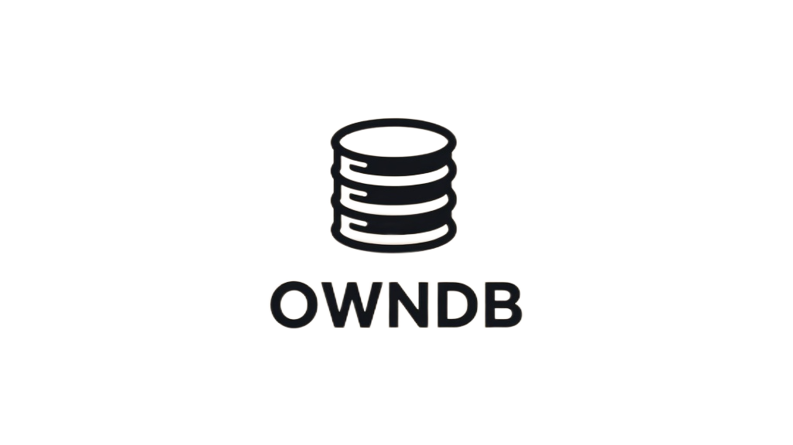

# Own Database Implementation

<p align="center">

</p>

OwnDB - собственная реализация `key=value` базы данных.
База данных в своей реализации имеет две стороны: сервер и клиент, которые соединены по TCP.

1. [Описание](#особенности-реализации)
2. [Установка и запуск](#установка-и-запуск)

### Особенности реализации

Хранение данных осуществляется в бинарном формате, то есть каждый из поддерживаемых на данный момент форматов данных, представляется и сохраняется в бинарном файле.
При запуске сервера бинарник проходит этап десериализации и сохраняет данные в рантайме, то есть в мапе.

что делать, ведь при перезапуске сервера данные будут потеряны?

на этот случай предусмотрен механизм WAL. 

### Что такое WAL и зачем он нужен?

WAL (Write-Ahead Logging) - это метод обеспечения целостности данных, который использует логгирование запросов перед их применением. При ошибке или внезапной остановке сервера все запросы будут восстановлены и выполнены на последний снэпшот данных для того, чтобы восстановить все данные.

### Как происходит общение между клиентом и сервером?

Тут все просто, по TCP клиент подключается к серверу и отправляет запрос, который написал пользователь.
Но вот тут уже интереснее.

В данной реализации написан DSL.

### О своем языке программирования

Можно замахнуться и сказать, что был разработан свой
просто, но все же, язык программирования!
ну почти..

DSL (Domain-Specific Language) - это специализированный язык программирования, который разрабатывается для решения каких то узконаправленных задач, к примеру, всеми любимый SQL.

А еще этот язык программирования имеет типы данных, которые используются для оптимизации сериализации и десериализации данных.

Что умеет этот чудо ЯП?

1. Запись данных без типов (стринг по умолчанию)
```sql
SET key = 'value'
```

2. Запись данных, используя тип данных
```sql
SET STRING key = 'value'

--- ответ сервера
OK! 1.7119ms
```

> Типы данных, которые поддерживаются на данный момент:
> 
> 1. STRING <br>
> `SET STRING foo = 'bar';`
> 2. INT <br>
> `SET INT foo = 123;`
> 3. FLOAT <br>
> `SET FLOAT foo = 1.23;`
> 4. BOOL <br>
> `SET BOOL foo = FALSE;`

3. Получение данных

```sql
GET key;

--- ответ сервера
value
```

4. Удаление данных
```sql
RM key;

--- ответ сервера
OK! 0s

--- пробуем еще раз получить данные
GET key;

--- ответ сервера
undefined key: "key"
```

5. Получение всех доступных ключей
```sql
KEYS;

--- ответ сервера
"foobar"; "foo"; "fo";
```

6. Сохранение данных из WAL в бинарь
```sql
SAVE;
```

# Установка и запуск

1. Клонируем репозиторий
```shell
git clone https://github.com/algrvvv/owndb.git
```

2. Создаем свой конфигурационный файл
```shell
cp config.example.yml config.yml
```

3. Меняем конфигурацию под себя
4. Запускаем сервер

```shell
go run cmd/db/main.go --config config.yml
```

5. Запускаем клиента

```shell
go run cmd/cli/main.go --config config.yml
```

# Как то так

Буду рад любому вашему фидбеку, только добра!
